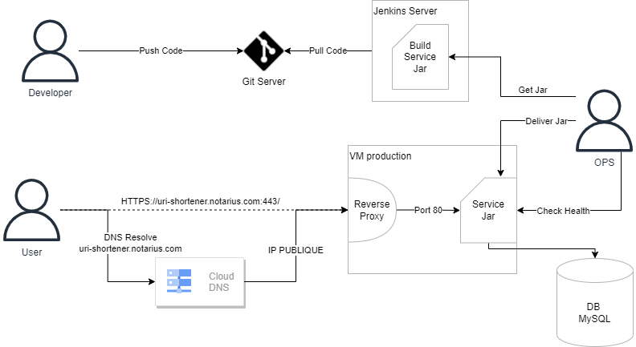

# Challenge DevOps

## Objectif du challenge

Dans l'optique de trouver le meilleur candidat pour rejoindre notre équipe, nous pensons que le moyen le plus efficace pour évaluer les compétences techniques d’une personne est de les mettre en pratique.

C’est pourquoi nous vous soumettons ce petit défi.

L’objectif de l’exercice est de nous faire une idée sur la façon dont vous mettez en pseudo-application une résolution de problématique DevOps : avec une partie technique minime et une préparation en avance mais surtout une présentation de votre solution lors d'une entrevue en personne. 

Lorsque vos travaux vous paraissent satisfaisants, vous pouvez nous le rendre disponible via commit sur le repository github (Il est accessible seulement pour vous).

Nous en prendrons connaissance et vous contacterons ensuite pour planifier l’entrevue en personne.

Nous sommes vraiment ravis que vous soyez interessés à rejoindre notre équipe et avons hâte de vous rencontrer!

## Projet : migration d'un service sur Docker en production

Le défi consiste à se mettre dans le contexte d'un service Java en production fonctionnant actuellement sur une VM dans un Cloud Provider.
Avec pour objectif pour le DevOps de rendre le service plus simple à livrer/surveiller et potentiellement le rendre scalable, il doit donc : 

* Dockeriser le service Java
* Automatiser le build
* Proposer un plan de migration d'une VM simple à un environnement docker orchestré

### Environnement actuel



#### Service Java

Le service Java est un service permettant de générer et fournir une URL raccourci à partir d'une URL complète.
Le service fonctionne avec les technologies suivantes : 

* Spring Boot comme framework de service Java
* Connecté à une base de données MySQL pour le stockage des données

Le service fournit par défaut : 

* Sur le port 8080 : une API JSON pour la création ou récupération d'URL et une interface web HTML basique utilisant cette API.

   Voir properties du application.properties  ```server.port```

* Sur le port 9090 : l'API Spring Boot Actuator pour valider l'état du service Java (exemple : http://localhost:9090/actuator/health) 

   Voir properties du application.properties  ```management.server.port```

#### Gestion du code et build

* Le code du service est maintenu sur un serveur GIT (Gitea), URL du repo : https://git-url.****.com/****/url-shortener.git  
(On suppose que le versionning du service est déjà géree et que tout est fait sur la branche master)
* Le build est géré par Maven par un job Jenkins : 
  * Avec le credentials ID Jenkins (Type usernamePassword) pour s'authentifier sur le serveur git : git_jenkins_user
  * Commande maven pour build le jar: 
     ``` mvn install```
  * Jar build disponible avec par exemple pour cette version le chemin : ```.\target\urlshortener-1.0.1.jar```
* Le job est lancé manuellement et le jar build par maven est mis en artifact pour etre récupérable par les OPS (Admin Operation)
* On suppose que l'on a aussi un Docker Registry privé hébergé sur le Cloud Provider avec les credentials (username/token) déja configuré sur le server jenkins
   *  Credentials ID Jenkins (Type usernamePassword) pour s'authentifier sur le registry docker : docker_jenkins_user
   *  URI repository docker name: private-registry.***.com/uri-shortener


#### En production
Le service est donc déployé sur une VM dans un Cloud Provider avec : 

* Une IP Publique pour etre accessible : IP_PUBLIQUE
* Un service de reverse proxy (e.g:nginx) sur le port 443 avec un certificat SSL qui renvoie en localhost sur le port 80
* Le service de gestion d'URL, avec : 
   * Le port 80 en écoute pour prendre les requetes HTTP
   * Le port 90 en écoute pour pouvoir surveiller l'état du service
   * Le jar (qui est remplacé manuellement par OPS pour les mise à jour)
   * Un fichier application.properties externe contenant les configurations pour la production (dans le dossier "config" à coté du jar ) : 
      * les ports de production pour le service
      * L'URI de connection au serveur MySQL : jdbc:mysql://IP_MYSQL:3306/db
      * Le user et mot de passe au user MySQL (seulement connu par OPS) : username_***/password_****
      
C'est le service DNS du Cloud Provider qui a la configuration modifiable : uri-shortener.*****.com -> IP_PUBLIQUE

## Rendu attendu 

Le but de ce défi n'est pas de vous prendre trop de temps et surtout pas d'argent !
 
On ne veut pas que vous mettiez en place un environnement du service (même local) en place qui soit fonctionnel, le but est de démontrer quelques connaissances de technologie pour la partie dev/build et théorique et réflexion pour la partie ops : 

* Un dockerfile (ou autre) permettant de construire une image docker contenant et lancant le service (non obligatoirement fonctionnel)
* Un jenkinsfile permettant de build le service, construire l'image docker et la pousser sur le registry docker privé (non obligatoirement fonctionnel)
* Un plan pour : 
   * Mettre en place le service sur un environnement docker orchestré fourni ou hébergé par un cloud provider (AWS de préférence)
   * Comment faire la migration de la VM vers le nouvel environnement en impactant le moins possible les utilisateurs. 
   ( On n'attend pas un plan détaillé : un schéma simple avec un peu de texte dans le style de celui présent dans ce document suffit tant que vous etes pret à l'expliquer lors de l'entretien)  
* Des idées pour l'amélioration du service (Build, monitoring, scalabilité,... )


